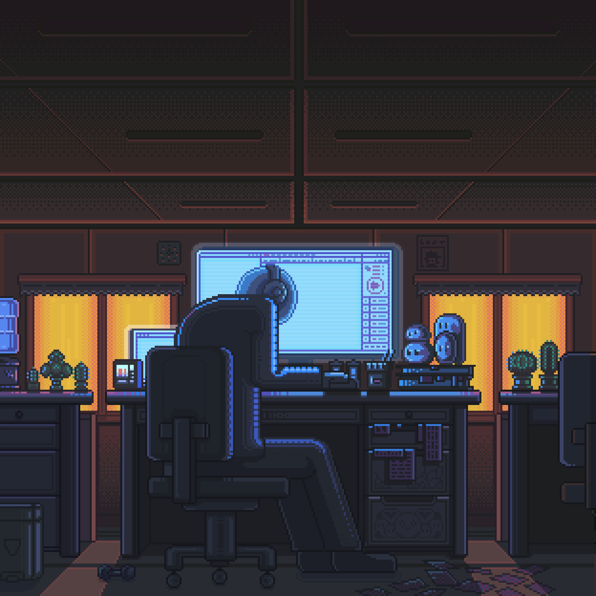

  <!-- Typing SVG Header -->
  

  <h1>Hey there, I'm <a href="https://github.com/PriyanshCG">Priyansh Patel</a> 🚀</h1>
  
<strong>Frontend Developer · DSA Learner · Cricket Fan</strong>

  

    
    
    
    
    
  

   

  <!-- Animated Media Banner -->
  

 

---

## 📊 Live Interactive Terminal & Contribution Graph

  <h3><code>PriyanshCG@github ~ $ ./contributions.sh</code></h3>

  

    

  <h3><code>PriyanshCG@github ~ $ whoami</code></h3>

  <table>
  <tr>
  <td valign="top"></td>
  <td valign="top"></td>
  </tr>
  </table>

---

## 👨‍💻 About Me & What I Do

<table width="100%">
<tr>
<td width="55%" valign="top">

### 🔭 Currently Working On
- ⚡ Building responsive web & mobile apps with **React & React Native**
- 💻 Solving **Data Structures & Algorithms (DSA)** problems daily in **C / C++**
- 🚀 Developing backend services with **Node.js, Express & MongoDB**

### 🎯 Learning & Education
- 🎓 Learning full-stack software development at **Coding Gita**
- 🎨 Crafting clean user interface designs in **Figma**

</td>
<td width="45%" align="center" valign="middle">

  

</td>
</tr>
</table>

---

## 🛠️ Tech Stack & Skills Showcase

### 🎨 Frontend & Mobile Development

  
  
  
  
  
  

### 🐍 Backend Engineering

  
  
  

### 🛢️ Databases & Caching

  
  

### ☁️ Cloud & Tools

  
  
  
  

### 🛠️ Architecture & Skill Icons Overview

  

---

## 🏆 GitHub Analytics & Stats

  <!-- Trophies -->
  

    

  <table border="0">
    <tr>
      <td width="50%" align="center">
        
      </td>
      <td width="50%" align="center">
        
      </td>
    </tr>
    <tr>
      <td colspan="2" align="center">
         
        
      </td>
    </tr>
  </table>

---

## ✍️ Dev Quote of the Day

  

---

## 🌐 Connect With Me

  
Let's collaborate, discuss ideas, or build something extraordinary!

  
  
  
  
  

    
  

   
  <strong>⭐ If you like my projects, consider giving them a star!</strong>

